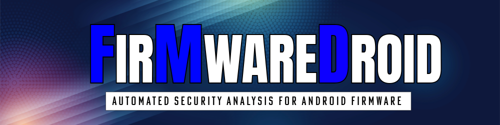

[](https://GitHub.com/Naereen/StrapDown.js/graphs/commit-activity)
[](https://www.python.org/)




# FirmwareDroid (FMD)
FirmwareDroid is a research project that aims to develop novel methods to analyse Android firmware. It is mainly made 
to automate the process of extracting and scanning pre-installed Android apps for security research purposes. 
FMD is made to run in docker and includes several third party analysis tools for security analysis and extraction.
Some of the tools and features included are:

* Static-Analyzers for Android apps:
  * [AndroGuard](https://github.com/androguard/androguard)
  * [Quark-Engine](https://github.com/quark-engine/quark-engine)
  * [APKiD](https://github.com/rednaga/APKiD/)
  * [Exodus-Core](https://github.com/Exodus-Privacy/exodus-core/)
  * [APKLeaks](https://github.com/dwisiswant0/apkleaks/)
  * [MobSFScan](https://github.com/MobSF/mobsfscan)
  * [Qark](https://github.com/linkedin/qark/) (deprecated, no updates by the author)
  * [Androwarn](https://github.com/maaaaz/androwarn/) (deprecated, no updates by the author)
  * [SUPER Android Analyzer](https://github.com/SUPERAndroidAnalyzer/super/) (deprecated, discontinued by the author)
* APIs:
  * [VirusTotal](https://www.virustotal.com)
* Fuzzy-Hashing:
  * [SSDeep](https://ssdeep-project.github.io/ssdeep/index.html)
  * [TLSH](https://tlsh.org/)
* Decompilers:
  * [Apktool](https://apktool.org/)
  * [Jadx](https://github.com/skylot/jadx)
* File Extraction:
  * [Unblob](https://github.com/onekey-sec/unblob)
* Miscellaneous:
  * AndroidManifest Parsing

In this repository you will find the code for the backend of FMD. The application has a minimal React
frontend (see https://github.com/FirmwareDroid/FMD-WebClient), but is mainly an API and database 
that can be used for research studies.

Usage documentation can be found at: https://firmwaredroid.github.io/

### Contributing

We are happy to accept contributions to the software and documentation. Feel free to open a pull request with your
enhancements.

### Security

FMD has only a minimal set of security features and is not a production ready software. Use at your own risk.

### Publications

[FirmwareDroid: Towards Automated Static Analysis of Pre-Installed Android Apps](https://ieeexplore.ieee.org/document/10172951)
``` 
@INPROCEEDINGS{FirmwareDroid,
  author={Sutter, Thomas and Tellenbach, Bernhard},
  booktitle={2023 IEEE/ACM 10th International Conference on Mobile Software Engineering and Systems (MOBILESoft)}, 
  title={FirmwareDroid: Towards Automated Static Analysis of Pre-Installed Android Apps}, 
  year={2023},
  month={May},
  pages={12-22},
  doi={10.1109/MOBILSoft59058.2023.00009}
}
```
  
### License:
FirmwareDroid is a non-profit research project licenced under the GNU General Public License v3.0
(see our [licence](https://github.com/FirmwareDroid/FirmwareDroid/blob/main/LICENSE.md)).
